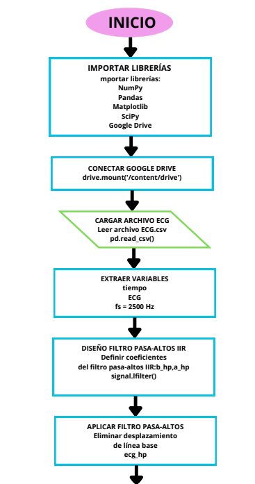
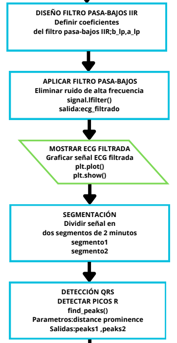
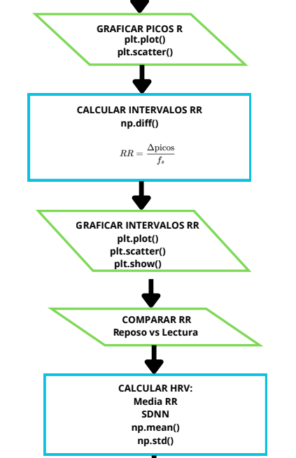
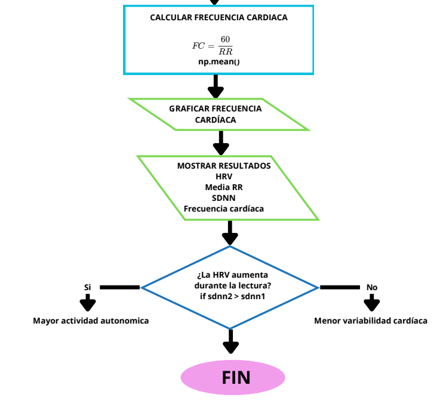
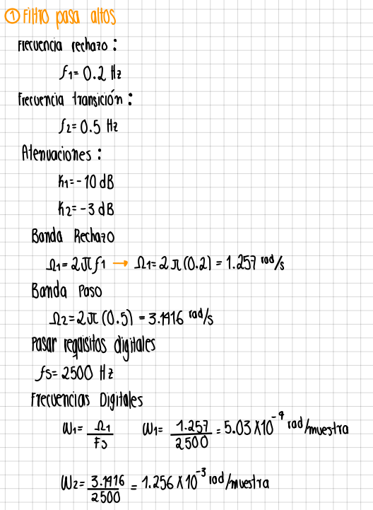
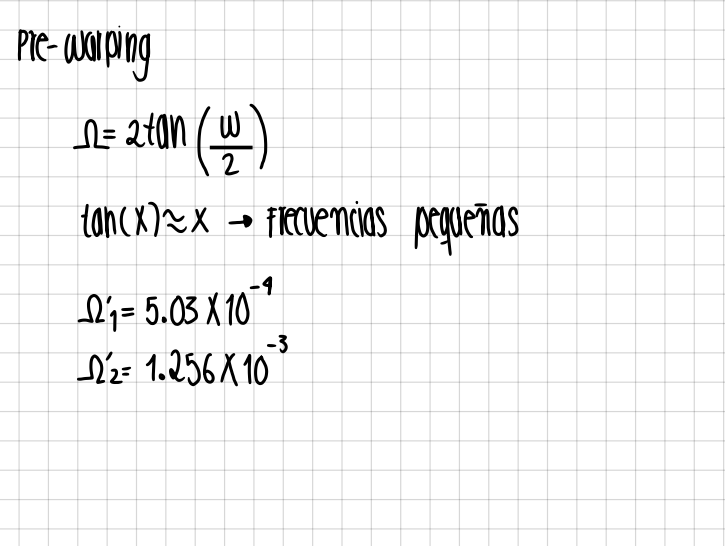
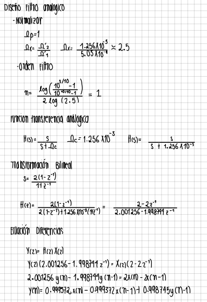
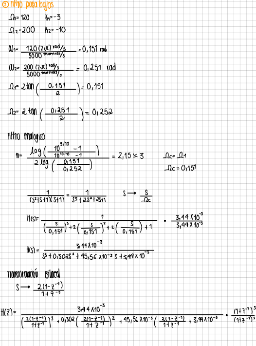
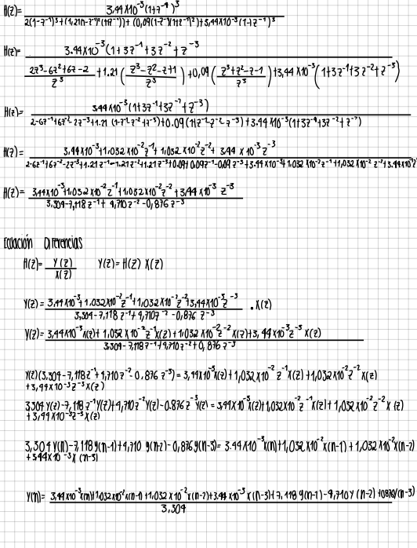

# LAB 5 
# Variabilidad de la Frecuencia Cardíaca (HRV) y balance autonómico 
## DESCRIPCIÓN 
Esta práctica tuvo como objetivo analizar la variabilidad de la frecuencia cardíaca (HRV) a partir de señales electrocardiográficas (ECG), con el fin de identificar cambios en el balance autonómico del sistema nervioso simpático y parasimpático. Para ello, se adquirió una señal ECG durante dos condiciones experimentales diferentes: reposo y lectura en voz alta.
Posteriormente, la señal fue sometida a un proceso de preprocesamiento mediante filtros digitales IIR para reducir el ruido e interferencias presentes durante la adquisición. Después del filtrado, se realizó la detección de los picos R y el cálculo de los intervalos R-R, permitiendo obtener métricas de HRV en el dominio del tiempo, como la media y la desviación estándar de los intervalos cardíacos.

Finalmente, se construyeron diagramas de Poincaré para cada segmento de la señal, permitiendo evaluar el comportamiento autonómico mediante los índices de actividad vagal (CVI) y actividad simpática (CSI). El análisis comparativo permitió evidenciar las variaciones fisiológicas producidas por las diferentes condiciones de adquisición.
## OBJETIVOS 
- Adquirir señales electrocardiográficas bajo condiciones de reposo y actividad verbal controlada.
- Diseñar e implementar filtros digitales IIR para el preprocesamiento de la señal ECG.
- Detectar los picos R y calcular los intervalos R-R de la señal cardíaca.
- Analizar parámetros de HRV en el dominio del tiempo, como la media y la desviación estándar de los intervalos R-R.
- Construir y analizar diagramas de Poincaré para evaluar la actividad simpática y parasimpática.
- Comparar los cambios fisiológicos observados entre las diferentes condiciones experimentales.

## PARTE A
### DIAGRAMA 


### 1. Fundamento teórico 
#### Actividad Simpática y Parasimpática del Sistema Nervioso Autónomo

El sistema nervioso autónomo regula las funciones involuntarias del cuerpo, incluyendo la función cardíaca, a través de dos ramas principales: el sistema simpático y el sistema parasimpático

Actividad Simpática: Generalmente asociada con respuestas de "lucha o huida", aumenta ante el estrés mental y cambios posturales (como pasar de estar acostado a estar de pie)

Actividad Parasimpática: Domina en estados de reposo, siendo su tono máximo cuando el sujeto se encuentra en posición supina (acostado boca arriba)


#### Efecto de la actividad simpática y parasimpática en la frecuencia cardíaca

Ambos sistemas ejercen un control antagónico sobre el nodo sinoauricular para regular el ritmo cardíaco
La estimulación simpática tiende a incrementar la frecuencia cardíaca (taquicardia) y es un marcador de la interacción simpato-vagal durante el estrés.

La estimulación parasimpática reduce la frecuencia cardíaca y es responsable de las variaciones rápidas latido a latido. El balance entre estas dos ramas produce fluctuaciones constantes en los intervalos entre latidos.

#### Variabilidad de la Frecuencia Cardíaca (HRV) a partir de un ECG

La HRV se define como la fluctuación de los intervalos R-R (el tiempo entre ondas R sucesivas en un electrocardiograma)

Medición: Se obtiene disparando la detección de la onda R en una señal de ECG, usualmente de una derivación estándar como la II, con una alta frecuencia de muestreo para garantizar precisión (ej. 2000 Hz)

Análisis convencional: Históricamente se han usado métodos como la desviación estándar (SD) y el análisis espectral. El análisis espectral divide la variabilidad en componentes de alta frecuencia (HF), que reflejan exclusivamente el tono vagal, y de baja frecuencia (LF), que reflejan tanto el tono simpático como el vagal.

#### Diagrama de Poincaré como herramienta de análisis de la serie R-R

El diagrama de Poincaré, también llamado Lorenz Plot, es una técnica de análisis no lineal que grafica cada intervalo R-R (Ik) contra el intervalo siguiente (Ik+1).


Interpretación Fisiológica del Gráfico:

Las dimensiones y la dispersión geométrica del gráfico permiten interpretar el estado del Sistema Nervioso Autónomo (SNA):
- Puntos muy dispersos: Alta variabilidad global (HRV); indica una buena modulación autonómica y salud cardíaca.
- SD1 alto (Ancho): Cambios rápidos entre latidos consecutivos. Está regulado por el sistema parasimpático (tono vagal).
- SD2 alto (Largo): Cambios lentas a largo plazo. Refleja la variabilidad global con fuerte influencia del sistema simpático.
- Elipse ancha: SD1 elevado. Indica un predominio parasimpático (estado de reposo y relajación).
- Elipse delgada (forma de cigarrillo): SD2 predomina sobre SD1. Indica un predominio simpático (estado de estrés, verbalización o alerta).

#### Variabilidad de la frecuencia cardíaca (HRV) y balance autonómico 

La función de la HRV (Variabilidad de la Frecuencia Cardíaca) y del balance autonómico es servir como un mecanismo de adaptación continua que permite al organismo responder de manera eficiente a los constantes cambios del entorno interno y externo (estrés, digestión, ejercicio, descanso, etc.).

##### Función de la HRV (Capacidad de Adaptación)
La HRV no es un proceso que el cuerpo controle conscientemente, sino el reflejo de un corazón flexible.
- Homeostasis y resiliencia: Un corazón sano no late al ritmo de un metrónomo perfecto; varía milisegundo a milisegundo. Una alta HRV indica que el corazón tiene una gran capacidad para adaptarse rápidamente a imprevistos (por ejemplo, pasar de estar sentado a correr, o recuperarse de un susto).
- Indicador de salud global: Una HRV baja significa que el ritmo cardíaco se ha vuelto rígido y monótono, lo cual es una señal de que el cuerpo está atrapado en un estado de estrés crónico, fatiga o enfermedad, perdiendo su flexibilidad adaptativa.

  ##### Función del Balance Autonómico (El Equilibrio Dinámico)

  El balance autonómico es la regulación recíproca entre las dos ramas del Sistema Nervioso Autónomo (SNA). Su función es actuar como un sistema de "acelerador y freno" para optimizar los recursos energéticos del cuerpo:

- Rama Simpática (Acelerador): Su función es preparar al cuerpo para la acción, el esfuerzo y la supervivencia (reacción de lucha o huida). Ante el estrés físico, el esfuerzo mental o actividades como la verbalización (hablar en público), libera noradrenalina para aumentar la frecuencia cardíaca, redistribuir la sangre hacia los músculos y optimizar la atención. En este estado, la HRV disminuye temporalmente porque el sistema prioriza la estabilidad rítmica para mantener un bombeo de sangre constante
- Rama Simpática (Acelerador): Su función es preparar al cuerpo para la acción, el esfuerzo y la supervivencia (reacción de lucha o huida). Ante el estrés físico, el esfuerzo mental o actividades como la verbalización (hablar en público), libera noradrenalina para aumentar la frecuencia cardíaca, redistribuir la sangre hacia los músculos y optimizar la atención. En este estado, la HRV disminuye temporalmente porque el sistema prioriza la estabilidad rítmica para mantener un bombeo de sangre constante

  ### b. Adquisición de la señal ECG

Se seleccionó a un sujeto de prueba (voluntario) para la instrumentación y registro de la señal electrocardiográfica (ECG). El protocolo constó de dos etapas consecutivas de 2 minutos cada una: una fase inicial de reposo basal en total silencio y una fase posterior de verbalización activa. Durante la captura en tiempo real, se implementó un filtro de Kalman para la atenuación de ruido y artefactos de movimiento. Los datos filtrados se exportaron y almacenaron en formato .csv, permitiendo su posterior importación en un entorno de Google Colab para la programación, procesamiento y visualización de la señal.

##### Código Adquisición

```python
from pathlib import Path
from datetime import datetime
import csv
import numpy as np
import matplotlib.pyplot as plt
import nidaqmx
from nidaqmx.constants import AcquisitionType

# ==========================================
# PARÁMETROS
# ==========================================
fs = 2500
duracion = 240  # 4 minutos
canal = 'Dev8/ai0'

total_muestras = int(fs * duracion)

# ==========================================
# ADQUISICIÓN
# ==========================================
with nidaqmx.Task() as task:

    task.ai_channels.add_ai_voltage_chan(canal)

    task.timing.cfg_samp_clk_timing(
        rate=fs,
        sample_mode=AcquisitionType.FINITE,
        samps_per_chan=total_muestras
    )

    print("Adquiriendo señal ECG (4 minutos)...")

    task.start()

    # ❌ NO wait_until_done (CAUSA DEL ERROR)

    senal = task.read(
        number_of_samples_per_channel=total_muestras,
        timeout=300  # 🔥 importante: mayor que 240 s
    )

print("Adquisición terminada")

# ==========================================
# CONVERTIR
# ==========================================
senal = np.array(senal)

# ==========================================
# FILTRO KALMAN
# ==========================================
senal_filtrada = np.zeros(len(senal))
P = np.zeros(len(senal))

Q = 0.0001
R = 0.01

senal_filtrada[0] = senal[0]
P[0] = 1

for k in range(1, len(senal)):

    x_pred = senal_filtrada[k - 1]
    P_pred = P[k - 1] + Q

    K = P_pred / (P_pred + R)

    senal_filtrada[k] = x_pred + K * (senal[k] - x_pred)

    P[k] = (1 - K) * P_pred

# ==========================================
# TIEMPO
# ==========================================
t = np.arange(len(senal)) / fs

# ==========================================
# GUARDAR CSV
# ==========================================
desktop = Path.home() / "Desktop"
nombre = input("Nombre del archivo: ")

if nombre.strip() == "":
    nombre = "ECG_4MIN"

fecha = datetime.now().strftime("%Y%m%d_%H%M%S")

archivo = desktop / f"{nombre}_{fecha}.csv"

with open(archivo, 'w', newline='') as f:
    writer = csv.writer(f, delimiter=';')

    writer.writerow(["Tiempo", "ECG Original", "ECG Filtrado"])

    for i in range(len(senal)):
        writer.writerow([t[i], senal[i], senal_filtrada[i]])

print("Guardado en:", archivo)

# ==========================================
# GRÁFICA
# ==========================================
plt.figure(figsize=(15,6))
plt.plot(t, senal, alpha=0.5, label="ECG Original")
plt.plot(t, senal_filtrada, linewidth=2, label="ECG Filtrado Kalman")

plt.title("ECG 4 minutos - Filtro Kalman")
plt.xlabel("Tiempo (s)")
plt.ylabel("Voltaje (V)")
plt.grid()
plt.legend()
plt.show()
```
## PARTE B
La señal electrocardiográfica (ECG) puede verse afectada por diferentes tipos de ruido durante su adquisición, como desplazamiento de línea base, interferencia eléctrica y ruido muscular. Por esta razón, es necesario realizar un pre-procesamiento digital que permita mejorar la calidad de la señal antes de analizarla.

En esta práctica se trabajó con una señal ECG adquirida durante 240 segundos con una frecuencia de muestreo de 2500 Hz. Para eliminar las componentes no deseadas se diseñaron e implementaron filtros digitales IIR tipo Butterworth. Primero se utilizó un filtro pasa-altos para remover las componentes de baja frecuencia asociadas al desplazamiento de línea base, y posteriormente un filtro pasa-bajos para atenuar el ruido de alta frecuencia y preservar las componentes fisiológicas importantes del ECG.

Después del filtrado, la señal se dividió en dos segmentos de 2 minutos y se realizó la detección de los picos R del complejo QRS. A partir de estos picos se calcularon los intervalos R-R y posteriormente se llevó a cabo el análisis de la variabilidad de la frecuencia cardíaca (HRV) en el dominio del tiempo, utilizando parámetros como la media de los intervalos R-R y su desviación estándar (SDNN), permitiendo comparar el comportamiento cardíaco entre ambas condiciones analizadas.

### DIAGRAMA 





## Pre-procesamiento de la señal
### Selección de parámetros del filtro IIR

Se diseñó un filtro pasa-altos IIR para eliminar el ruido de baja frecuencia presente en la señal ECG, especialmente la deriva de línea base causada por respiración y movimiento de electrodos.

Frecuencia de rechazo:
f1=0.2 Hz
Se escogió porque las componentes muy bajas de frecuencia corresponden principalmente al ruido y movimiento lento de la señal.

Frecuencia de transición:
f2=0.5 Hz
Se seleccionó debido a que por encima de 0.5 Hz se encuentra la información útil del ECG, especialmente los complejos QRS y los picos R.

Atenuación en banda de rechazo
k1=−10 dB
Se utilizó para reducir significativamente el ruido de baja frecuencia.

Atenuación en banda de paso
k2=−3 dB
Se escogió porque corresponde al punto típico de corte de filtros Butterworth, permitiendo una transición suave sin deformar la señal ECG.

Frecuencia de muestreo
fs=2500 Hz
Corresponde a la frecuencia con la que fue adquirida la señal ECG y permite representar correctamente la actividad cardíaca y detectar los picos R con buena resolución temporal.







Para el diseño del filtro IIR pasa-bajos se seleccionaron los parámetros 
ω1=120
ω2=200
K1=−3 dB 
K2=−10 dB
Debido a las características espectrales de la señal ECG y a la necesidad de eliminar componentes de ruido de alta frecuencia sin alterar la información fisiológica importante.

La señal ECG concentra la mayor parte de su contenido útil en bajas frecuencias, especialmente las ondas P, T y el complejo QRS. Por esta razón, se estableció una frecuencia de paso de:

ω1=120
con el objetivo de conservar adecuadamente las componentes cardíacas relevantes de la señal y evitar distorsiones en su morfología.

Posteriormente, se seleccionó una frecuencia de rechazo de:
ω2=200
para comenzar a atenuar componentes de alta frecuencia asociadas principalmente al ruido muscular (EMG), interferencias electrónicas y perturbaciones del sistema de adquisición.

La atenuación en banda de paso se fijó en:

K1=−3 dB

debido a que este valor corresponde al punto de corte típico de un filtro Butterworth, permitiendo conservar la amplitud de la señal ECG sin pérdidas significativas.

Por otra parte, la atenuación en banda de rechazo se seleccionó como:

K2=−10 dB

con el fin de lograr una reducción suficiente del ruido de alta frecuencia sin incrementar excesivamente el orden del filtro ni el costo computacional.




### Análisis de la HRV en el dominio del tiempo 


  
## PARTE C 
En esta etapa se construyeron los diagramas de Poincaré a partir de los intervalos R-R obtenidos de la señal ECG, permitiendo analizar la dispersión y el comportamiento dinámico de la frecuencia cardíaca durante las condiciones de reposo y lectura en voz alta. Además, se implementó la elipse de dispersión para calcular los parámetros SD1 y SD2 asociados a la variabilidad cardíaca.

Finalmente, se calcularon los índices CSI y CVI con el fin de evaluar la actividad simpática y parasimpática del sistema nervioso autónomo, comparando los cambios fisiológicos presentes en cada segmento de la señal.
### DIAGRAMA 
## PROGRAMACIÓN 
Sí, está bien explicado y técnicamente correcto, pero tiene algunos detalles de redacción y precisión que puedes mejorar para que suene más profesional en el informe. Te recomiendo dejarlo así:

Se realiza el diagrama de Poincaré a partir de la definición de una función `poincare_plot`, la cual recibe como entrada la serie de intervalos R-R. Dentro de la función se crean dos arreglos: `rr_n`, que contiene todos los intervalos R-R excepto el último, y `rr_n1`, que contiene todos los intervalos excepto el primero. De esta manera, cada punto `rr_n`, `rr_n1` representa un intervalo cardíaco y su intervalo consecutivo.

Posteriormente, se realiza la visualización gráfica donde cada punto corresponde a un par de intervalos consecutivos. Además, se agrega una línea diagonal como referencia, indicando la condición ideal en la que todos los intervalos R-R serían iguales. Finalmente, la función es aplicada a ambos segmentos de la señal ECG para comparar el comportamiento de la variabilidad cardíaca en cada condición experimental.

```python 
def poincare_plot(rr, titulo):
    rr_n = rr[:-1]  # RR(n)
    rr_n1 = rr[1:] # RR(n+1)

    plt.figure(figsize=(6,6))

    plt.scatter(
        rr_n,
        rr_n1,
        s=20,
        color='deeppink'
    )
    # Línea diagonal
    minimo = min(rr_n.min(), rr_n1.min())
    maximo = max(rr_n.max(), rr_n1.max())
    plt.plot(
        [minimo, maximo],
        [minimo, maximo],
        'k-',
        linewidth=1
    )

    plt.xlabel('RR(n) [s]')
    plt.ylabel('RR(n+1) [s]')
    plt.title(titulo)
    plt.grid(True)
    plt.axis('equal')
    plt.show()
poincare_plot( rr1, "Poincaré - Reposo (0-2 min)")
poincare_plot( rr2, "Poincaré - Lectura (2-4 min)")
```
## Calculos SD1 y SD2
Primero se calcula la diferencia y la suma entre los intervalos R-R consecutivos `rr_n1` y `rr_n`, normalizándolos por `` con el fin de proyectar los datos sobre los ejes principales del diagrama de Poincaré. Posteriormente, se calcula la desviación estándar de cada una de estas componentes, obteniendo así los parámetros SD1 y SD2, los cuales permiten cuantificar la dispersión transversal y longitudinal de la nube de puntos, respectivamente.

## Graficas 
Se realizaron dos tipos de diagramas de Poincaré para analizar la variabilidad de la frecuencia cardíaca. En los primeros diagramas, correspondientes únicamente a la nube de puntos, fue posible observar la dinámica de los intervalos R-R y su comportamiento entre latidos consecutivos. A partir de la distribución de los puntos se pudo identificar si la señal presentaba un comportamiento más estable, disperso o irregular. Además, la forma y dispersión de la nube permitieron visualizar el patrón general de la variabilidad cardíaca en cada segmento de la señal ECG, facilitando la comparación entre las condiciones de reposo y lectura en voz alta.
### Poincare sin elipse


##

